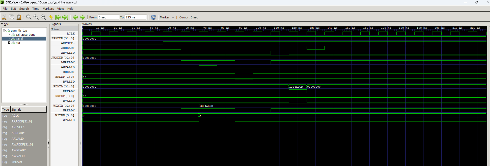

# AXI4-Lite UVM Verification IP for Slave Register Block

## Project Overview

This project implements a UVM-based verification environment for an AXI4-Lite slave register block. The DUT contains four 32-bit memory-mapped registers and supports AXI4-Lite read/write transactions, byte-wise write strobes, valid address decoding, invalid address error response, functional coverage, scoreboard checking, protocol assertions, and regression automation.

This project demonstrates practical ASIC Design Verification skills using SystemVerilog, UVM, constrained-random testing, functional coverage, assertions, and Synopsys VCS simulation.

---

## Features

- AXI4-Lite slave RTL with four 32-bit registers
- Complete UVM testbench architecture
- Directed write/read testing
- Multi-register testing
- Invalid address SLVERR testing
- WSTRB partial write testing
- Constrained-random write/read testing
- Scoreboard-based checking
- Functional coverage collection
- SystemVerilog protocol assertions
- Automated regression script

---

## Register Map

| Address | Register |
|--------:|----------|
| 0x00 | REG0 |
| 0x04 | REG1 |
| 0x08 | REG2 |
| 0x0C | REG3 |

Valid accesses return `OKAY = 2'b00`.

Invalid accesses return `SLVERR = 2'b10`.

---

## Project Structure

```text
Axi4_lite_UVM_vip/
├── assertions/
│   └── axi4_lite_assertions.sv
├── docs/
│   └── waveform.png
├── rtl/
│   └── axi4_lite_slave.sv
├── scripts/
│   └── run_regression.sh
├── sim/
│   └── filelist.f
├── tb/
│   ├── axi4_lite_if.sv
│   ├── axi4_lite_pkg.sv
│   ├── tb_top.sv
│   └── uvm_tb_top.sv
├── .gitignore
└── README.md

---

## Verification Architecture

The UVM environment includes:

| Component | Description |
|----------|-------------|
| `axi4_lite_txn` | Transaction class |
| `axi4_lite_sequencer` | Schedules sequence items |
| `axi4_lite_driver` | Drives AXI4-Lite transactions |
| `axi4_lite_monitor` | Observes bus activity |
| `axi4_lite_scoreboard` | Checks expected vs actual behavior |
| `axi4_lite_coverage` | Collects functional coverage |
| `axi4_lite_agent` | Groups sequencer, driver, and monitor |
| `axi4_lite_env` | Connects agent, scoreboard, and coverage |

---

## Testcases

| Test Name | Description |
|----------|-------------|
| `axi4_lite_basic_test` | Basic write and readback test |
| `axi4_lite_multi_reg_test` | Writes and reads all four registers |
| `axi4_lite_invalid_addr_test` | Checks SLVERR response for invalid addresses |
| `axi4_lite_wstrb_test` | Verifies byte-wise partial writes using WSTRB |
| `axi4_lite_random_test` | Performs constrained-random write/read transactions |

---

## Functional Coverage

The coverage model includes:

- Operation coverage: READ and WRITE
- Address coverage: valid and invalid addresses
- Response coverage: OKAY and SLVERR
- WSTRB coverage: byte-enable patterns
- Cross coverage between operation/address and operation/response

---

## Assertions

SystemVerilog assertions check protocol behavior:

- `AWVALID` remains asserted until `AWREADY`
- `WVALID` remains asserted until `WREADY`
- `ARVALID` remains asserted until `ARREADY`
- `BVALID` remains asserted until `BREADY`
- `RVALID` remains asserted until `RREADY`
- `BRESP` uses only valid response values
- `RRESP` uses only valid response values

---

## Waveform

The waveform below shows a basic AXI4-Lite write followed by readback.



---

## How to Run

Load Synopsys VCS:

```bash
module load synopsys
module load vcs/T-2022.06-SP2-2
```

Run full regression:

```bash
cd scripts
./run_regression.sh
```

Expected result:

```text
Passed: 5
Failed: 0
ALL TESTS PASSED
```

---

## Manual Compile and Run

From the `sim` directory:

```bash
vcs -full64 -sverilog -ntb_opts uvm -timescale=1ns/1ps -f filelist.f -l compile_uvm.log
```

Run a specific test:

```bash
./simv +UVM_TESTNAME=axi4_lite_random_test -l random_test.log
```

---

## Regression Result

The full regression passed all tests:

```text
Passed: 5
Failed: 0
ALL TESTS PASSED
```

No UVM errors or fatal errors were reported:

```text
UVM_ERROR : 0
UVM_FATAL : 0
```

---

## Tools Used

- SystemVerilog
- UVM
- Synopsys VCS
- GTKWave
- Linux shell scripting
- Git/GitHub

---

## Key Learning Outcomes

This project demonstrates:

- Building a UVM verification environment from scratch
- Creating reusable UVM components
- Writing directed and constrained-random tests
- Implementing scoreboard-based checking
- Adding functional coverage
- Adding protocol assertions
- Running automated regressions
- Debugging simulation using logs and waveforms

---

## Resume Highlight

Built an AXI4-Lite UVM Verification IP for a slave register block using SystemVerilog and UVM, including driver, monitor, scoreboard, functional coverage, constrained-random tests, protocol assertions, waveform debug, and automated regression using Synopsys VCS.
